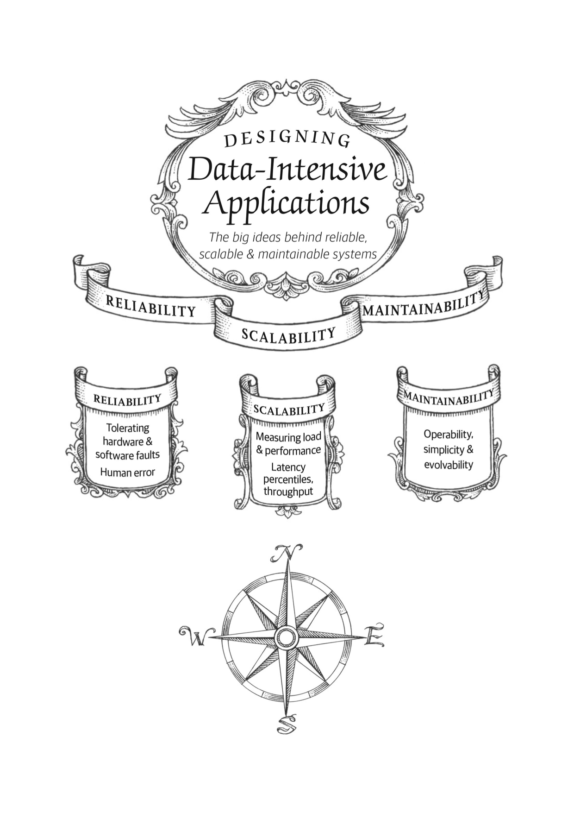

# markdown 常用语法

## 导航

- [markdown 常用语法](#markdown-常用语法)
  - [导航](#导航)
  - [标题](#标题)
  - [正文](#正文)
  - [格式化](#格式化)
    - [斜体和加粗](#斜体和加粗)
    - [删除线](#删除线)
    - [分割线](#分割线)
  - [列表](#列表)
    - [有序列表](#有序列表)
    - [无序列表](#无序列表)
    - [任务列表](#任务列表)
  - [引用](#引用)
  - [超链接](#超链接)
  - [图片](#图片)
  - [代码](#代码)
  - [表格](#表格)
  - [End](#end)

## 标题

## 正文

这是一段正文

## 格式化

### 斜体和加粗

* 斜体用一个`*`包括起来, *斜体*
* 加粗用两个`*`包括起来, **加粗文本**
* 加粗斜体用3个`*`包括起来, ***加粗斜体***

### 删除线

~~被删除的文本~~

### 分割线

---

## 列表

### 有序列表

1. 有序列表用数字后加`.` 和 `空格` 来表示。
    1. 子列表项1
    2. 子列表项2
2. 列表项2。

### 无序列表

* 无序列表用`*`,`+`,`-`加空格和内容表示。
* 同一层级尽量用同样的表示
  + 不同的层级可以用不同的表示
    - 不同的层级可以用不同的表示
* 列表项2。
  + 子列表项。
    - 子列表的子列表项

### 任务列表

本周6 **todo list**

* [x] 8.30早起跑步一小时，完成
* [x] 12:00 做午饭，已完成
* [ ] 下午看书一小时， 未完成
  
---

## 引用

* 单层引用

markdown 使用 >开头的段落 表示引用
> 莎士比亚说过 to be or not to be,
>
> that is a questestion.

* 多级引用
  
> qsc 说过 "
>>
>> 莎士比亚说过
>> tobe or not to be, that is a questestion."

## 超链接

* 使用`[文本](链接)`来表示超链接
* 可以用`[文本](#标题)` 来链接到当前页面的其他标题
* 使用`[无序列表](#无序列表)`链接到[无序列表](#无序列表)

## 图片

* 图片用``
* 插入本地图片
* 插入网络图片
  
## 代码

```c
#include <stdio.h>
int main()
{
    printf("hello markdown");
    return 0;
}
```

## 表格

|物品|价格  |数量  |
|---|:---|:-----:|
|计算机| ￥4000| 20|
|显示器| ￥ 1000| 40|

## End

if you have any question, please contcat <akxxsb@vip.qq.com>